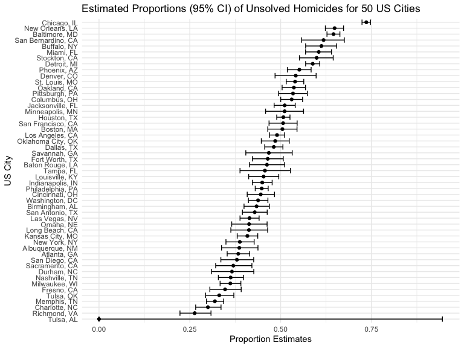

p8105_hw5_kpp2126
================
Kevin P. Patterson
2022-11-13

## Problem 1

1.  Create a tidy dataframe containing data from all participants,
    including the subject ID, arm, and observations over time *Start
    with a dataframe containing all file names; the `list.files`
    function will help Iterate over file names and read in data for each
    subject using `purrr::map` and saving the result as a new variable
    in the dataframe *Tidy the result; manipulate file names to include
    control arm and subject ID, make sure weekly observations are
    “tidy”, and do any other tidying that’s necessary

``` r
longitudinal_df = 
  tibble(
    files = list.files("./data/p1_data/"), #listing the "./" method due to inability to read with "/data" alone
    path = str_c("./data/p1_data/", files)
  ) %>% 
  mutate(data = purrr::map(path, read_csv)) %>% 
  unnest()

#tidy df
longtidy_df = 
  longitudinal_df %>% 
  mutate(
    files = str_replace(files, ".csv", ""),
    group = str_sub(files, 1, 3)) %>% 
  pivot_longer(
    week_1:week_8,
    names_to = "week",
    values_to = "outcome",
    names_prefix = "week_") %>% 
  mutate(week = as.numeric(week)) %>% 
  select(group, subj = files, week, outcome)
```

2.  Make a spaghetti plot showing observations on each subject over
    time, and comment on differences between groups.

``` r
spaghetti_plot = longtidy_df %>% 
  ggplot(aes(x = week, y = outcome, group = subj, color = group)) + 
  geom_point() + 
  geom_path() + 
  facet_grid(~group)
spaghetti_plot
```


## Problem 2

``` r
rawhom_df =
  read_csv("data/homicide_data.csv")
```

1.  Describe the raw data. The resulting `rawhom_df` raw dataframe has
    52179 observations and 12 variables. These 12 variables detail
    individual homicide demographic information such as `uid`,
    `reported_date`, victim’s first and last name, race, age, sex, city,
    state, location indicators latitude & longitude, and disposition.

2.  Create a `city_state` variable (e.g. “Baltimore, MD”) using `mutate`
    and then;

3.  `Summarize` within cities to obtain the total number of homicides
    and the number of unsolved homicides (those for which the
    disposition is “Closed without arrest” or “Open/No arrest”).

``` r
tidyhom_df = rawhom_df %>%
  mutate(city_state = str_c(city, state, sep = ", "), #create city_state variable
         disposition = ifelse(disposition %in% c("Closed without arrest", "Open/No arrest"), "unsolved", disposition)) %>% #create unsolved vs Closed by arrest distinction within the disposition variable
  group_by(city_state) %>%
  summarize(
    total_homicides = n(),
    unsolved_homicides = sum(disposition == "unsolved") #create the summarized variables
  ) %>%
  arrange(desc(total_homicides)) #arranging by descending order to better visualize the count data

#fixing Milwaukee, wI to WI
tidyhom_df = tidyhom_df %>%
  mutate(city_state = ifelse(city_state %in% c("Milwaukee, wI"), "Milwaukee, WI", city_state))

knitr::kable(head(tidyhom_df[, 1:3]), "simple") #Tulsa, AL is an error showing 1 homicide and 0 unsolved.
```

| city_state       | total_homicides | unsolved_homicides |
|:-----------------|----------------:|-------------------:|
| Chicago, IL      |            5535 |               4073 |
| Philadelphia, PA |            3037 |               1360 |
| Houston, TX      |            2942 |               1493 |
| Baltimore, MD    |            2827 |               1825 |
| Detroit, MI      |            2519 |               1482 |
| Los Angeles, CA  |            2257 |               1106 |

4.  For the city of Baltimore, MD, use the `prop.test` function to
    estimate the proportion of homicides that are unsolved;

-   save the output of prop.test as an R object, apply the `broom::tidy`
    to this object and pull the estimated proportion and confidence
    intervals from the resulting tidy dataframe.

``` r
estimate = 
  prop.test(
  tidyhom_df %>%
    filter(city_state == "Baltimore, MD") %>%
    pull(unsolved_homicides),
  tidyhom_df %>%
    filter(city_state == "Baltimore, MD") %>%
    pull(total_homicides))

broom::tidy(estimate)
```

    ## # A tibble: 1 × 8
    ##   estimate statistic  p.value parameter conf.low conf.high method        alter…¹
    ##      <dbl>     <dbl>    <dbl>     <int>    <dbl>     <dbl> <chr>         <chr>  
    ## 1    0.646      239. 6.46e-54         1    0.628     0.663 1-sample pro… two.si…
    ## # … with abbreviated variable name ¹​alternative

The estimated proportion (95% CI) of homicides that are unsolved for the
city of Baltimore, MD is 0.646 (0.628, 0.663).

5.  Now run `prop.test` for each of the cities in your dataset, and
    extract both the proportion of unsolved homicides and the confidence
    interval for each.

-   Do this within a “tidy” pipeline, making use of `purrr::map`,
    `purrr::map2`, list columns and `unnest` as necessary to create a
    tidy dataframe with estimated proportions and CIs for each city.

``` r
tidycity_df =
  tidyhom_df %>%
  mutate(
    proptest_outputs = purrr::map2(.x = unsolved_homicides, .y = total_homicides, ~prop.test(x = .x, n = .y)),
    estimate_outputs = purrr::map(.x = proptest_outputs, ~broom::tidy(.x))
  ) %>% 
  select(-proptest_outputs) %>% 
  unnest(estimate_outputs) %>% 
  select(city_state, estimate, conf.low, conf.high, p.value) %>% #included p.value as an additional context for the estimate
  arrange(desc(estimate))
```

6.  Create a plot that shows the estimates and CIs for each city – check
    out geom_errorbar for a way to add error bars based on the upper and
    lower limits. Organize cities according to the proportion of
    unsolved homicides.

``` r
tidycity_df %>%
  mutate(city_state = fct_reorder(city_state, estimate)) %>%
  ggplot(aes(x = estimate, y = city_state)) +
  geom_point() +
  geom_errorbar(aes(xmin = conf.low, xmax = conf.high)) +
  labs(
    title = "Estimated Proportions (95% CI) of Unsolved Homicides for 50 US Cities",
    y = "US City",
    x = "Proportion Estimates"
  )
```



## Problem 3

1.  First set the following design elements:

-   Fix n=30
-   Fix σ=5
-   Set μ=0.

2.  Generate 5000 datasets from the model

-   x∼Normal\[μ,σ\]
-   For each dataset, save μ̂ and the p-value arising from a test of
    H:μ=0 using α=0.05
-   Hint: to obtain the estimate and p-value, use broom::tidy to clean
    the output of t.test.

``` r
set.seed(1) #setting the seed here for reproducibility

#(1) create function
sim_ttest = function(n = 30, mu = 0, sigma = 5) { #fixing the function design
  
  sim_df = tibble(
      x = rnorm(n = n, mean = mu, sd = sigma) #generating the simulation dataframe
    )
  
  sim_df %>% 
    summarize(
        t_test = t.test(x, mu = 0, conf.level = 0.95) %>% #running t.test on x dataframe
        broom::tidy() %>% 
        select(estimate, p.value)) %>%  #selecting these to mutate more easily later
    mutate(
      mu_hat = t_test$estimate,
      p_value = t_test$p.value) %>% #had to mutate the t.test outputs using baseR
    select(mu_hat,p_value)
}

#(2) simulate 5000 datasets using function sim_ttest
output = vector("list", length = 5000)

for (i in 1:5000) {
  output[[i]] = sim_ttest(mu = 0)
}

sim_5000_results = bind_rows(output)
```

3.  Repeat the above for μ={1,2,3,4,5,6}, and complete the following:

``` r
sim_six_test =
  tibble(
    mu = c(1, 2, 3, 4, 5, 6)) %>% 
  mutate(
    ttest_lists = map(.x = mu, ~rerun(5000, sim_ttest(mu = .x))),
    estimate_dfs = map(ttest_lists, bind_rows)) %>% 
  select(-ttest_lists) %>% 
  unnest(estimate_dfs)

#sim_six_test
```

-   Make a plot showing the proportion of times the null was rejected
    (the power of the test) on the y axis and the true value of μ on the
    x axis.

``` r
plot_power = 
  sim_six_test %>% 
  filter(p_value < 0.05) %>% #showing only when null was rejected
  group_by(mu) %>% #grouping by the 1:6 iterations
  summarize(rejection = n()) %>% #getting counts of rejection
  mutate(prop_rejection = rejection / 5000) %>% #calculating proportion of times null was rejected from 5000 simulations
  ggplot(aes(x = mu, y = prop_rejection)) +
  geom_point() + 
  geom_line() +
  scale_x_continuous(limits = c(0,6), breaks = seq(0, 6, by=1)) +
  scale_y_continuous(limits = c(0.1,1), breaks = seq(0.1, 1, by=0.1)) +
  labs(
    title = "The Power of the Test",
    y = "Power",
    x = "True μ"
  )
plot_power
```

 -
Describe the association between effect size and power. The `plot_power`
illustrates that as the true mu increases (effect size) the power of
rejecting the null hypothesis also increases. We see that the power
reaches a threshold near 1 as the true mu = 4.

-   Make a plot showing the average estimate of μ̂ on the y axis and the
    true value of μ on the x axis

``` r
plot1 = 
  sim_six_test %>% 
  group_by(mu) %>% 
  summarize(average_estimate_mu = mean(mu_hat)) %>% 
  ggplot(aes(x = mu, y = average_estimate_mu)) +
  geom_point() +
  geom_line() +
  scale_x_continuous(limits = c(0,6), breaks = seq(0, 6, by=1)) +
  scale_y_continuous(limits = c(0,7), breaks = seq(0, 7, by=1)) + #keeping the same axis for better comparison in combined plot
  labs(
    title = "Average estimates of μ by true value of μ",
    x = "True μ",
    y = "Average estimated μ"
  )
plot1
```


-   Make a second plot (or overlay on the first) the average estimate of
    μ̂ only in samples for which the null was rejected on the y axis and
    the true value of μ on the x axis.

``` r
plot2 =
  sim_six_test %>% 
  filter(p_value < 0.05) %>% 
  group_by(mu) %>% 
  summarize(average_estimate_mu = mean(mu_hat)) %>% 
  ggplot(aes(x = mu, y = average_estimate_mu)) +
  geom_point() + 
  geom_line()+
  scale_x_continuous(limits = c(0,6), breaks = seq(0, 6, by=1)) +
  scale_y_continuous(limits = c(0,7), breaks = seq(0, 7, by=1)) + #keeping the same axis for better comparison in combined plot
  labs(
    title = "Average estimates of μ for rejected null tests by true μ",
    x = "True μ",
    y = "Average estimated μ"
  )
plot2
```


**combined plots**

``` r
plot1 + plot2
```


-   Is the sample average of μ̂ across tests for which the null is
    rejected approximately equal to the true value of μ? Why or why not?
    Similar to the trend taking place in the “Power of the test” plot,
    we see here that as the true mu increases there is better fit
    between true mu and mu_hat. For mu \~3 or larger the two plots are
    relatively equal because the power of the test increases when the
    effect size increases.For values below 3, the sample average of
    mu_hat for tests that result in the null being rejected are not
    great approximation estimates of the true mu.
